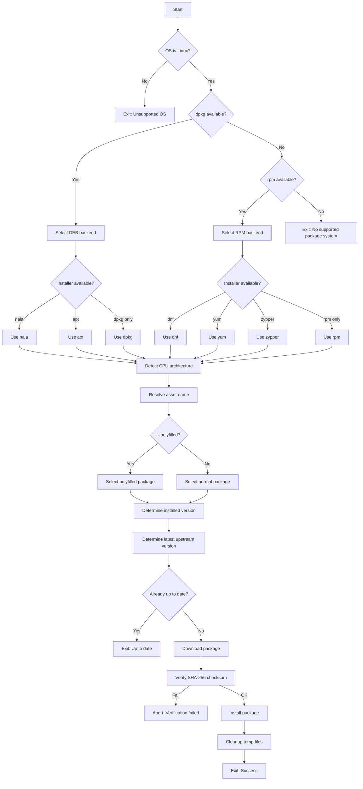

# update-fastfetch

A small POSIX `sh` script that updates **Fastfetch** on **Linux systems** by downloading the latest official package from GitHub Releases, **verifying its SHA-256 checksum**, and installing it using the native package tooling available on the system.

Supported package formats:

- `.deb` (Debian / Ubuntu and derivatives)
- `.rpm` (Fedora, RHEL, Rocky, Alma, openSUSE)

Non-Linux systems and manual archive installs (`.zip`, `.tar.*`) are intentionally out of scope.

## What it does

- Detects the operating system (**Linux only**)
- Detects the available package backend based on tooling:
  - Debian-like: `dpkg` → installer priority `nala > apt > dpkg`
  - RPM-like: `rpm` → installer priority `dnf > yum > zypper > rpm`
- Detects CPU architecture (`uname -m` → release asset token)
- Reads the installed Fastfetch version (or assumes `0.0.0` if not installed)
- Determines the latest upstream release version
  - Uses the GitHub API when available
  - Falls back to the GitHub `releases/latest` redirect if the API is unavailable or rate-limited
- Downloads the matching package to `/tmp`
- **Verifies the downloaded file’s SHA-256 checksum** against the checksum listed in the upstream release notes
  - If a matching checksum cannot be found, the script **aborts** (fails closed)
- Installs the verified package using the detected package manager

## Supported architectures (Linux)

Official Fastfetch release artifacts are supported for the following architectures:

- `amd64` (x86_64)
- `aarch64`
- `armv7l`
- `armv6l`
- `i686`
- `riscv64`
- `ppc64le`
- `s390x`

## Requirements

### Common

- `curl`
- `awk`
- `grep`
- `sha256sum`
- `sudo` *(only required when not running as root)*

### Debian-like systems

- One of: `nala`, `apt`, or `dpkg`

### RPM-like systems

- `rpm`
- One of: `dnf`, `yum`, `zypper`, or `rpm`

## Usage

```sh
update-fastfetch
```

### Flags (exactly 0 or 1 flag allowed [except for `--no-color`])

This script is intentionally strict: **use at most one flag**. If you provide multiple flags, unknown options, or positional arguments, it exits with code `2`.
The only exception is `--no-color`, which may be combined with other flags.

```sh
update-fastfetch --polyfilled
update-fastfetch --self-test
update-fastfetch --no-color
update-fastfetch --help
update-fastfetch --version
update-fastfetch --version --no-color
update-fastfetch --no-color --self-test
NO_COLOR=1 ./update-fastfetch -h
```

#### `--polyfilled`

Installs the *polyfilled* build (more portable), selecting:

- `fastfetch-linux-<arch>-polyfilled.deb`
- `fastfetch-linux-<arch>-polyfilled.rpm`

instead of the default non-polyfilled package.

#### `--self-test`

Runs diagnostic checks and exits (no install). It prints **OK / WARN / ERROR** for each check, runs all checks (no fail-fast), and ends with a **summary line**.

Checks performed include:

- Required tools for the detected backend
- Privilege mode (root vs sudo)
- GitHub reachability
- GitHub API availability (warn-only; fallback exists)
- Reachability of the `releases/latest` endpoint

#### `--no-color` / `NO_COLOR`

Disables colored output.

- Flag: `update-fastfetch --no-color`
- Env var: `NO_COLOR=1 update-fastfetch`

## Exit codes

- `0` success / already up-to-date / self-test passed
- `1` fatal error (missing dependency, checksum missing/mismatch, unsupported system, failed self-test, etc.)
- `2` invalid arguments (unknown option, positional argument, or multiple flags)

## Installation

Example:

```sh
sudo install -m 0755 update-fastfetch /usr/local/bin/update-fastfetch
```

## Notes on security

This script downloads official prebuilt Fastfetch packages from the upstream GitHub Releases page over HTTPS.

- It **verifies SHA-256** by scraping the upstream release notes for the checksum corresponding to the exact downloaded asset.
- If the checksum is missing or the release notes format changes such that the checksum cannot be found, the script **aborts** rather than installing an unchecked file.
- It does **not** verify signatures.

## Flowchart



## License

MIT
